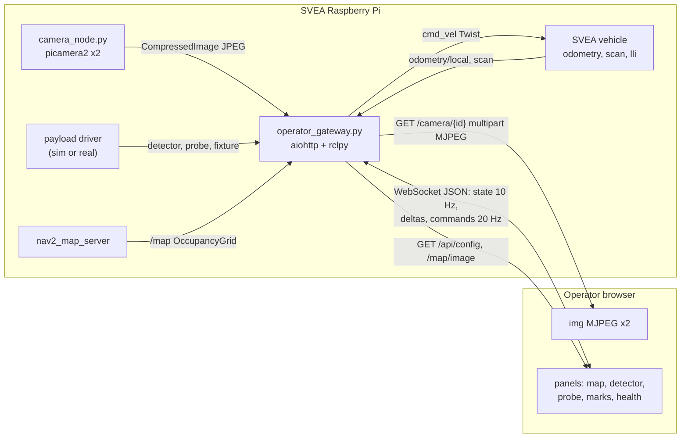

# Operator GUI master plan

Roadmap for growing the `peaceofmine_operator` dashboard from a simulation demo
into the real mission GUI: two live CSI cameras over MJPEG, teleop on the
existing lease/arm/deadman safety model, the prebuilt occupancy map with pose
and overlays, real metal-detector and probe instrumentation, plus mission
marking, coverage tracking, and health monitoring.

All paths below are relative to the repository root.

## Where we are today

The GUI already exists and is better structured than it looks:
`src/peaceofmine_operator/scripts/operator_gateway.py` is an aiohttp HTTP +
WebSocket server bridged to rclpy,
`src/peaceofmine_operator/scripts/simulated_payload.py` fakes the detector and
probe hardware, and `src/peaceofmine_operator/dashboard/` is three plain static
files with no build step.

Three things it does **not** have:

- **No real video.** The "VIRTUAL FORWARD CAMERA" is a `<canvas>` drawing fake
  lane lines. There is no `sensor_msgs/Image` subscriber anywhere in the
  workspace.
- **No real map.** The "Field map" panel is a hand-drawn grid, not an occupancy
  grid. The real maps do exist as PGM + YAML in `src/svea_core/maps/`, and
  `nav2_map_server` is already a dependency of `svea_localization`.
- **No mission output.** Detections are ephemeral markers in RAM, capped at 20,
  discarded on restart.

What it *does* have and we must not break: the control lease, explicit arming,
deadman, the 0.25 s command watchdog, and the 0.5 s zero-command stop tail in
`_drive_watchdog`, backed independently by `twist_consumer`'s own
`cmd_timeout`.

## Target architecture



Everything stays on **one port** (8080) so a single TLS config, a single
firewall rule, and a single URL keep working.

## Phase 0 - Frontend restructure (enabler, do first)

`src/peaceofmine_operator/dashboard/app.js` is ~580 lines and already holds four
render loops. Everything below roughly quadruples it, so split it before adding,
not after. No bundler and no npm; native ES modules keep the
`colcon build --symlink-install` story intact.

- Split into `dashboard/js/`: `net.js` (socket, reconnect, config fetch),
  `state.js`, `input.js` (gamepad + keyboard + deadman), `panels/*.js` one per
  panel. `index.html` loads `<script type="module" src="/assets/js/main.js">`.
- The gateway's asset route is a hardcoded two-file allow-list and will 404
  every new module (`operator_gateway.py`, lines 364-371):

  ```python
  async def asset_handler(request: web.Request) -> web.FileResponse:
      # ament's symlink install makes the packaged assets symlinks during
      # development, and aiohttp's generic static route refuses symlinks by
      # design, so serve this small explicit allow-list instead.
      filename = request.match_info['filename']
      if filename not in {'app.js', 'style.css'}:
          raise web.HTTPNotFound()
      return web.FileResponse(dashboard / filename)
  ```

  Replace with a subtree handler using `{path:.*}`, resolving the request
  against the dashboard directory and rejecting anything whose resolved path is
  not under it. That keeps the symlink-install behaviour and drops the
  allow-list.
- `setup.py` uses `glob('dashboard/*')`, which is non-recursive. Add explicit
  entries for each subdirectory.
- Introduce a small panel registry so panels can be collapsed and the grid
  rearranged, with three layout presets: **Drive** (forward camera dominant),
  **Search** (map + detector dominant), **Probe** (probe camera + force curve
  dominant).

## Phase 1 - Two live cameras

Confirmed on this Pi: `rpicam-hello` is present and `import picamera2` succeeds
on the host. A Pi 5 has two CSI connectors, so both cameras attach directly.

- New `scripts/camera_node.py` in `peaceofmine_operator` publishing
  `sensor_msgs/CompressedImage` (JPEG) on `camera/forward/image_raw/compressed`
  and `camera/probe/image_raw/compressed`, relative names so the SVEA namespace
  still applies. Params per camera: `index`, `width`, `height`, `fps`,
  `jpeg_quality`, `rotation`.
- Pluggable capture backend so the same node covers every case: `picamera2` on
  hardware, `v4l2`/OpenCV fallback, and a synthetic moving test pattern so
  `operator_sim.launch.py` keeps working with no cameras plugged in.
- Gateway subscribes to a configurable list of compressed-image topics, holds
  only the latest frame per camera, and serves `GET /camera/{id}` as
  `multipart/x-mixed-replace` MJPEG plus `GET /camera/{id}/snapshot` for stills.
  Going through ROS rather than serving from the camera node directly means the
  streams are also rosbag-recordable and Foxglove-viewable for free.
- Dashboard: the forward camera becomes the main viewport `` and the
  keyboard focus target (replacing `#forward-view`); the probe camera gets its
  own panel with a swap/picture-in-picture toggle. Keep a transparent `<canvas>`
  **over** the video for the HUD (speed, crosshair, detector bar), so the
  existing overlay drawing survives the switch.
- Staleness: if no frame arrives for ~2 s, overlay `NO SIGNAL` and grey the
  panel. A frozen last frame during teleop is a genuine safety hazard.

**Risk to verify early:** `util/run` already gives the non-DEV container
`--privileged`, `-v /dev:/dev`, and host networking, but the Jazzy/Ubuntu 24.04
image has no `picamera2` and its stock libcamera may lack the Pi 5 PiSP pipeline
handler. Verify inside the container first. Fallbacks in order of preference:
add the Raspberry Pi apt repo plus `python3-picamera2` to `docker/Dockerfile`,
use `ros-jazzy-camera-ros`, or run `camera_node.py` natively on the host against
the same ROS domain.

## Phase 2 - Real map of the mine

- Launch `nav2_map_server` plus its lifecycle manager from the operator launch
  with a new `map_name` argument defaulting to one of the existing maps in
  `src/svea_core/maps/` (`floor2`, `sml`, `itrl`, `q1`, `penn_state_lab`, all of
  which have PGMs present).
- Gateway subscribes `/map` (`nav_msgs/OccupancyGrid`, transient-local), renders
  it **once** to PNG server-side with numpy + Pillow (both already in
  `requirements.txt`), and serves `GET /map/image`; resolution, origin, width,
  and height go in `GET /api/config`. Do not push an occupancy grid through the
  10 Hz JSON blob.
- Map panel: PNG base layer, pose transformed through origin/resolution,
  pan/zoom, follow-robot toggle, north-up vs robot-up.
- Overlays, each independently toggleable: driven trail, live `scan` lidar
  points, detector coverage shading, target marks, probe sample points.

## Phase 3 - Detector and probe instrumentation

**Metal detector** - keep the signal readout, threshold meter, radar sweep and
sweep controls, and add:

- **Audio tone** via WebAudio, pitch and repetition rate scaling with signal
  strength, mutable. This is how real detectors are operated and it lets the
  operator watch the video instead of a number.
- Signal strip-chart over time, alongside the existing angular radar.
- Ground-balance/zero button and an operator-adjustable threshold, as new
  commands and topics (`detector/zero`, `detector/threshold`), with the
  authoritative value staying in the gateway as it does today.

**Probe** - keep depth, pressure, and the motion interlocks (rejects motion
above `probe_motion_speed_limit_mps`, or on `probe/fault`), and add:

- **Force-versus-depth curve**, not just pressure-versus-time. The shape of
  resistance as the probe descends is the actual diagnostic signal for
  distinguishing a hard object from soil.
- Retract-to-stow button, per-insertion records, and the probe camera view
  sitting directly beside the curve.

`simulated_payload.py` grows matching simulated outputs so all of this is
demonstrable without hardware.

## Phase 4 - Mission record: marks, coverage, export

This is the part that turns the GUI from a driving toy into the thing that
produces the deliverable.

- **Mark target**: an operator command that records pose, timestamp, detector
  peak, the probe force curve, a snapshot from both cameras, and a
  classification (suspected mine / clutter / cleared) with a free-text note.
- Persist to a mission directory on disk so marks survive a gateway restart,
  serve them back as a list panel with click-to-centre on the map, and export
  via `GET /mission/export.geojson` and `.csv`.
- **Coverage grid** accumulated in the gateway from pose plus fixture angle and
  shaded on the map. For demining, the question "what have I *not* swept yet"
  matters as much as "what did I find", and nothing in the current GUI answers
  it.
- Mission timer, and optionally rosbag record start/stop from the GUI.

## Phase 5 - Health, safety, situational awareness

- **Per-source staleness**: every telemetry field carries an age; panels grey
  out when their source goes quiet, so a dead node never looks like a healthy
  zero.
- **Link quality**: WebSocket round-trip ping, video fps and dropped-frame
  counters. Teleop over a degrading link needs to *look* degraded.
- **Vehicle health**: battery/voltage where available (the uORB `power_monitor`
  topic via `px4_uorb_tunnel.py` is the only current source; there is no
  first-class battery topic today), plus Pi CPU load and temperature.
- **Attitude**: roll/pitch indicator from IMU with a tilt warning, relevant on
  mine-field ground.
- **Creep mode**: an operator speed cap slider, clamped in the gateway, for fine
  positioning over a suspected target.
- Always-visible E-stop and a keyboard shortcut overlay.

## Protocol changes

The current design broadcasts one `state` blob to everyone at 10 Hz. That does
not scale to maps and coverage grids, so split by change rate:

- `GET /api/config` - once per session: limits, camera list, map metadata, topic
  names.
- `type: 'state'` at 10 Hz - scalars only, as today.
- `type: 'delta'` - append-only growth: new coverage cells, new marks, trail
  points.
- Video entirely outside the WebSocket, on its own HTTP routes.

Command handling, the lease check, and the clamping in `handle_command` stay
exactly as they are; new commands slot into the same `message_type` dispatch
behind the same lease gate.

## Safety invariants to preserve throughout

- Lease transfer always disarms and zeroes the command.
- Deadman must be true on every `drive` message; 20 Hz command rate, 0.25 s
  freshness window.
- 0.5 s zero-command stop tail, then silence, so the gateway never holds
  `twist_consumer`'s watchdog open.
- Limits are authoritative in the gateway; the browser only ever *displays* them
  from telemetry. Every new control follows this same pattern.
- Per `AGENTS.md`: nothing motion-related gets tested on the real vehicle first.
  Simulation, then lifted wheels, with the RC override ready.

## Verification per phase

```bash
colcon build --symlink-install --packages-up-to peaceofmine_operator
source install/setup.bash
ros2 launch peaceofmine_operator operator_sim.launch.py
colcon test --packages-select peaceofmine_operator --event-handlers console_direct+
```

Plus the standing check: stop the command source mid-drive and confirm the
vehicle stops.

## Open questions worth settling before Phase 4

- Is the vehicle localised well enough for coverage tracking and marks to be
  trustworthy? Today `operator_sim.launch.py` runs with
  `use_localization=False`, so on hardware we need to decide between AMCL
  against the prebuilt map, slam_toolbox, or RTK GPS. Coverage shading is only
  as good as the pose behind it.
- What is the real payload hardware, and does it match the current `Float32`
  topic shapes? The simulated payload is the only implementation today.

## Task checklist

- [ ] **Phase 0** - split `dashboard/app.js` into ES modules under
      `dashboard/js/`, replace the gateway's two-file asset allow-list with a
      safe subtree handler, fix `setup.py` data_files globs, add a panel
      registry with collapsible panels and Drive/Search/Probe layout presets.
- [ ] **Phase 1a** - write `scripts/camera_node.py` publishing
      `sensor_msgs/CompressedImage` JPEG for forward and probe cameras, with
      picamera2, v4l2, and synthetic-test-pattern backends.
- [ ] **Phase 1b** - verify libcamera/picamera2 works for CSI cameras inside the
      Docker container; if not, add the Raspberry Pi apt repo and
      `python3-picamera2` to `docker/Dockerfile` or fall back to `camera_ros`.
- [ ] **Phase 1c** - gateway serves `GET /camera/{id}` as multipart MJPEG plus
      `/snapshot`; dashboard swaps the fake canvas for two live `` panels
      with a transparent HUD canvas overlay and NO SIGNAL staleness handling.
- [ ] **Phase 2** - launch `nav2_map_server` with a `map_name` argument, render
      `/map` to PNG server-side, serve it with metadata via `/api/config`, and
      rebuild the map panel with real pose, pan/zoom, follow-robot, trail, and
      lidar overlay.
- [ ] **Phase 3a** - detector upgrades: WebAudio pitch tone, signal strip-chart,
      ground-balance/zero and adjustable threshold commands and topics.
- [ ] **Phase 3b** - probe upgrades: force-versus-depth curve, retract-to-stow,
      per-insertion records, probe camera co-located; extend
      `simulated_payload.py` to feed all of it.
- [ ] **Phase 4a** - mark-target command recording pose, detector peak, probe
      curve, camera snapshots and classification; persist to a mission
      directory; marks list panel with click-to-centre.
- [ ] **Phase 4b** - coverage grid accumulated from pose and fixture angle, sent
      as WebSocket deltas and shaded on the map; GeoJSON/CSV mission export.
- [ ] **Phase 5** - per-source staleness ages, link quality and video fps
      indicators, battery/CPU/temperature, IMU attitude and tilt warning,
      gateway-clamped creep-mode speed cap, always-visible E-stop, shortcut
      overlay.
- [ ] **Docs** - update `src/peaceofmine_operator/README.md` and `docs/` for the
      new panels, camera setup, launch arguments, and hardware bring-up
      procedure.
