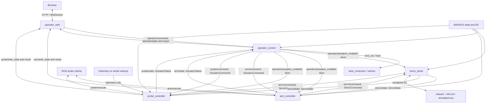
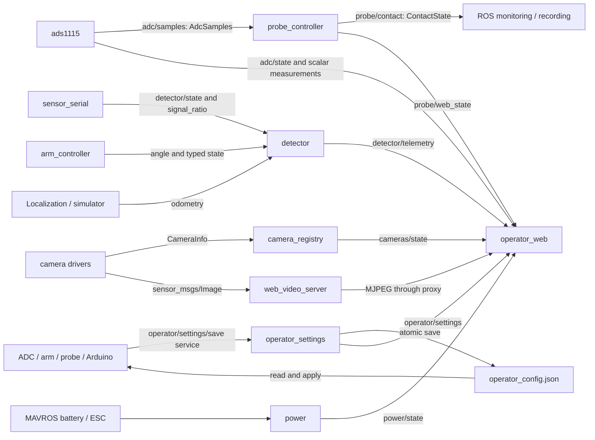

# Operator ROS graph

All names below are relative to the vehicle namespace (`/self` by default).
Both launch commands build the same graph. Simulation changes device access inside
`servo_driver` and `ads1115`, and adds simulated environment sources.

## Control and motor interfaces



| Interface | Type | Publisher/server | Subscribers/clients |
| --- | --- | --- | --- |
| `operator/command` | `std_msgs/String` browser envelope | web | control |
| `operator/state`, `operator/result` | `std_msgs/String` UI aggregates | control | web |
| `operator/actuation_enabled` | `std_msgs/Bool` | control | driver, arm, probe |
| `cmd_vel` | `geometry_msgs/Twist` | control | twist consumer |
| `arm/command`, `probe/command` | `peaceofmine_interfaces/ActuatorCommand` | control | respective controller |
| `arm/state`, `probe/state` | `peaceofmine_interfaces/ActuatorStatus` | respective controller | control; detector also consumes arm |
| `arm/web_state`, `probe/web_state` | `std_msgs/String` presentation data | respective controller | web |
| `arm/result`, `probe/result` | `std_msgs/String` browser acknowledgments | respective controller | web |
| `servo/command` | `peaceofmine_interfaces/ServoCommand` | arm, probe | driver |
| `servo/state` | `peaceofmine_interfaces/ServoState` | driver | arm, probe |
| `servo/configure` | `peaceofmine_interfaces/srv/ServoConfigure` | driver | actuator controllers |
| `arm/execute`, `probe/execute` | `peaceofmine_interfaces/action/ActuatorOperation` | respective controller | ROS clients |
| `fixture/angle_deg` | `std_msgs/Float32` | arm | detector, simulated environment |
| `fixture/sweep_enabled_state` | `std_msgs/Bool` | arm | detector |
| `fixture/sweep_speed_deg_s` | `std_msgs/Float32` | control | arm |
| `fixture/sweep_speed_deg_s_state` | `std_msgs/Float32` | arm | detector |
| `probe/depth_mm`, `probe/pressure_ratio` | `std_msgs/Float32` | probe | plot/recording clients; environment consumes depth |
| `probe/fault` | `std_msgs/Bool` | optional external hardware fault source; simulation environment | probe, control |

The old `servo_bus/request`, `servo_bus/reply`, and helper executor nodes are gone.
Sweep starts/stops use timestamped `ActuatorCommand`; the old un-timestamped
`fixture/sweep_enabled` input is no longer used. Motor register access is internal
to the driver. Firmware ownership permits only one active actuator.

## Sensors, settings and display



| Interface | Type | Publisher/server | Subscribers/clients |
| --- | --- | --- | --- |
| `adc/samples` | `peaceofmine_interfaces/AdcSamples` | ADC | probe; external recorders |
| `adc/{input}/raw` | `std_msgs/Int16` | ADC | external clients |
| `adc/{input}/volts`, `adc/{input}/scaled` | `std_msgs/Float64` | ADC | external clients |
| `adc/state` | `std_msgs/String` batches/settings for plots | ADC | web |
| `adc/command`, `adc/command_result` | `std_msgs/String` settings/run envelope | control / ADC | ADC / web |
| `probe/contact` | `peaceofmine_interfaces/ContactState` | probe | external clients |
| `operator/settings/save` | `peaceofmine_interfaces/srv/SaveSettings` | settings | ADC, arm, probe, sensor serial |
| `operator/settings/command`, `operator/settings/result` | `std_msgs/String` camera settings | control / settings | settings / web |
| `operator/settings` | `std_msgs/String` persisted preferences/revision | settings | web |
| `detector/amplitude_adc` | `std_msgs/UInt16` | sensor serial | external clients |
| `detector/signal_ratio`, `detector/fresh` | `std_msgs/Float32`, `std_msgs/Bool` | sensor serial | detector / external clients |
| `detector/state` | `std_msgs/String` calibration and device health | sensor serial | detector, control |
| `detector/command` | `std_msgs/String` calibration request | control | sensor serial, detector |
| `detector/telemetry` | `std_msgs/String` plot/detection aggregate | detector | web |
| `cameras/state`, `power/state` | `std_msgs/String` UI aggregates | registry / power | web |
| `simulation/probe_load_ratio` | `std_msgs/Float32` | simulated environment | simulated driver only |

ADC input names: `a0`, `a1`, `a2`, `a3`, `a0_a1`, `a0_a3`, `a1_a3`, `a2_a3`.
`adc/samples` contains timestamps, sequence numbers, channel IDs, raw/volts/scaled
values, connection session, configuration revision and validity. Scalar topics
publish only the newest reading per tick. Plot routing is presentation-only.
The former split contact/fresh Boolean topics are replaced by one `ContactState`;
`valid=false` means unknown, not clear.

With simulation or localization, the probe consumes `odometry_topic` (`nav_msgs/Odometry`).
Hardware without localization defaults to `probe_velocity_topic:=mavros/wheel_odometry/velocity`
(`geometry_msgs/TwistWithCovarianceStamped`). An explicit topic override is supported.
Detector georeferencing still needs actual odometry; wheel velocity is not a pose.
Missing sources leave their dependent feature unavailable.

## Inspect the live graph

```bash
ros2 run rqt_graph rqt_graph
ros2 topic list -t
ros2 service list -t
ros2 action list -t
ros2 interface show peaceofmine_interfaces/msg/ServoCommand
ros2 topic echo /self/servo/state
```

In rqt_graph select Nodes/Topics (all), filter `/self`, and show leaf topics when
inspecting ADC outputs. Services/actions have their own CLI listings; action
feedback and status use ROS-generated transport topics. Camera image topics depend
on discovered devices, and ESC telemetry depends on the optional PX4 tunnel source.

For implementation and safety contracts, see [architecture](architecture.md).
